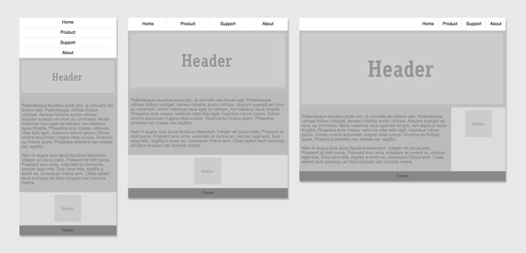

# Flexbox CSS3
===================

### How to play?
1. go to <http://hirokazunakajima.com/flexbox/>
2. resize browser size
3. navigation, content and siderbar position will be changing

### What is it working in behind?

* use __flex__ related property
* use __media query__ for switching CSS depending on browser size
* no __float property__ stying